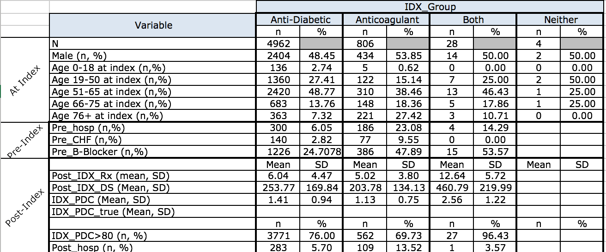

#Objective
The objective of this assignment is to create an analytic file from a dataset provided by QuantileIMS. An attrition data would be created upon the completion of the the analytic file.

We would like to identify patients that received either antidiabetics or anticoagulants from 1/1/13 to 3/31/13 (index date). Then and we would create pre and post index period (+/- 180 days from the index date), and generate new variables such as drug use, medical claims, diagnoses, medication adherence and medical events, for downstream analysis and modeling, which could help us to understand pre and post-index characteristics and drug adherence for specific patients.

After the data wrangling process, one should be able to answer these three questions:

  * How many (unique) patients are in the desired index range that have taken AD or AC drugs? 
  * How many of those patients have more than one drug on the index date?
  * How many have both antidiabetics and anticoagulant drugs on the index date?

```{r}
library(readr)
library(dplyr)
```

##Loading both of the calim data and Rx data
```{r}
claim_data <-read.csv('data/uopjan16_claims_in.csv', stringsAsFactors = FALSE)
rx_data <- read.csv('data/uopjanref_rx_lookup.csv', stringsAsFactors = FALSE)

dim(claim_data)
dim(rx_data)
```

##Data Wrangling

### Filtering NDC list in order to get the NDC numbers for Antidiabetics and Anticoagulants
```{r}
#change the dtypes of the ndc column to numeric.
claim_data$ndc <- as.numeric(claim_data$ndc)
rx_data$National.Drug.Code <- as.numeric(rx_data$National.Drug.Code)
```

```{r}
#Creating an NDC list for AD and AC drugs
NDC_list <- filter(rx_data, rx_group == 'ANTIDIABETICS'| rx_group == 'ANTICOAGULANTS')
```

### Merging claim data and NDC list to get record of patients that received either AC or AD medications
```{r}
#Patients in the data given AC or AD medications
claim_w_ACAD <- merge(claim_data, NDC_list, by.x = 'ndc', by.y = 'National.Drug.Code') %>% tbl_df()

claim_w_ACAD$pat_id %>% unique %>% length

```

### Narrowing down patients had their medications prescribed within index date range (1/1/13 to 3/31/13).
```{r}
claim_w_ACAD$from_dt <- as.Date(claim_w_ACAD$from_dt)
claim_w_ACAD$to_dt <- as.Date(claim_w_ACAD$to_dt)

claim_w_index_date <- filter(claim_w_ACAD, from_dt >= "2013/01/01" & to_dt <= "2013/03/31")
```

### Using the minimum prescription date in order to get the index date of a specific patient
```{r}
#First occurance of either AC/AD for these patients
first_occurance <- group_by(claim_w_index_date, pat_id) %>% filter(from_dt == min(from_dt))
first_occurance$pat_id %>% unique %>% length

#We have more unique patient more than it suppose to be, because some patients receive same type of drugs on the same date, hence more than one prescription recorded.
first_occurance %>% dim()
table(table(first_occurance$pat_id) >1)

#Select column that will be used in the final version of the analytic file.
analytic_file_final <- first_occurance %>% select(pat_id, rx_group, gen_nm, IDX_Date = from_dt)
analytic_file_final <- analytic_file_final %>% 
  mutate(IDX_group = ifelse(rx_group == 'ANTIDIABETICS', 'AD', 'AC'))
```

### Populate IDX_Group Column: The first claim for an AD, AC, both on same date (DC) or neither (null) during the index period (1/1/13 - 3/31/13)
```{r}
# check which patients who received more than one type of medications on the index date; extract their pat_id and use them as mask
tmp_index <- analytic_file_final %>% group_by(pat_id) %>% summarise(len = length(IDX_group))  %>% filter(len > 1)
tmp_index 

#filter out unrelated patients and narrow the dataframe down to patients who received more than one medciations on their index date
tmp_index_2 <- analytic_file_final %>% filter(pat_id %in% tmp_index$pat_id)

#check which patients received both AC and AD medications on their index date
tmp3 <- tmp_index_2 %>% group_by(pat_id) %>% mutate(tmp = unique(IDX_group)[1], tmp2 = unique(IDX_group)[2])
tmp3 <-filter(tmp3, tmp != is.na(tmp) & tmp2 != is.na(tmp2))
tmp3

#adding the IDX_Group into the analytic_file_final, label patients that received both drug types as 'DC'
analytic_file_final[analytic_file_final$pat_id %in% tmp3$pat_id,]$IDX_group = 'DC'

#removing duplicated pat_id
analytic_file_final <- subset(analytic_file_final, !duplicated(analytic_file_final[,1]))
```

### Populating YOB, Pat_Age, and Pat_sex for specific patient
```{r}
enroll_data <- read.csv('data/uopjan16_enroll_in.csv') %>% tbl_df
glimpse(enroll_data)

analytic_file_final <- select(enroll_data, pat_id, der_sex, der_yob) %>% merge(analytic_file_final, by = 'pat_id')
analytic_file_final %>% tbl_df

#calculate patients' ages as today
analytic_file_final <- analytic_file_final %>% mutate(age = parse_number(2013 - der_yob))
analytic_file_final %>% tbl_df
```

### Creating Pre and Post Index Date for each patient
```{r}
#creating pre and post date index
pre_post_filter <- select(analytic_file_final, pat_id, IDX_Date) %>% mutate(pre_index = IDX_Date - 180, post_index = IDX_Date + 180)

pre_post_filter %>% dim()
pre_post_filter %>% head
```

```{r}
#filter the data with post and pre index date 
tmp_df<-merge(claim_data, pre_post_filter, by = 'pat_id') %>% tbl_df

tmp_df$from_dt = as.Date(tmp_df$from_dt)
tmp_df$to_dt = as.Date(tmp_df$to_dt)

tmp_df %>% head %>% print.data.frame(width = Inf)

analytic_file_tmp <- filter(tmp_df, from_dt >= pre_index & from_dt <= post_index) 

analytic_file_tmp %>% tbl_df()
analytic_file_tmp %>% head %>% print.data.frame(width = Inf)
```

### Populating Pre_hosp
    A rectype = 'F', where to_dt - from_dt > 0, and the to_dt is prior to the IDX_Date
```{r}
#extract patients' index whom met the requriment of Pre_hosp
Pre_hosp_index <- analytic_file_tmp %>% filter(rectype == 'F', to_dt - from_dt > 0, to_dt < IDX_Date)
Pre_hosp_index <- unique(Pre_hosp_index$pat_id)

#labeling those who met the Pre_hosp requriment = 1, else = 0
analytic_file_final <- analytic_file_final %>% mutate(Pre_hosp = ifelse(pat_id %in% Pre_hosp_index, 1, 0))

```

### Populating Pre-CHF
    Claim must be a rectype M or F in diag1-2-3-4
```{r}
#these are IDH-9 codes that locate in diag1-2-3-4 columns that indicate specific patients were diagnosed CHF
diag_code = c(428, 4280, 4281 ,4282, 42820, 42821, 42822, 42823, 42830, 42831, 42832, 42833,
              42840, 42841, 42842, 42843, 4289)

Pre_CHF_index <- analytic_file_tmp %>% filter(rectype == 'M' | rectype == 'F' | rectype == 'S', diag1 %in% diag_code | 
                                       diag2 %in% diag_code | diag3 %in% diag_code | diag4 %in% diag_code,
                                       from_dt <= IDX_Date)

Pre_CHF_index <- unique(Pre_CHF_index$pat_id)


analytic_file_final <- analytic_file_final %>% mutate(Pre_CHF = ifelse(pat_id %in% Pre_CHF_index, 1, 0))
```

### Populating Beta-Blocker
```{r}
b_blockers_index <- filter(rx_data, rx_group == 'BETA BLOCKERS')
b_blockers_index <- b_blockers_index$National.Drug.Code

patient_b_blocker <- filter(analytic_file_tmp, ndc %in% b_blockers_index, from_dt < IDX_Date)
patient_b_blocker <- unique(patient_b_blocker$pat_id)

analytic_file_final <- analytic_file_final %>% mutate(Pre_B_Blocker = ifelse(pat_id %in% patient_b_blocker, 1, 0))
```

### Populating Post_IDX_Rx: Number of prescription claims for the index drug (at the generc name) from the index date to IDX-Date +180days
```{r}
patient_ACAD_pres <- filter(analytic_file_tmp, ndc %in% NDC_list$National.Drug.Code, from_dt >= IDX_Date)
Post_IDX_Rx_Index <- patient_ACAD_pres %>% group_by(pat_id) %>% summarise(Post_IDX_Rx = length(ndc))

analytic_file_final <- merge(analytic_file_final, Post_IDX_Rx_Index, by = 'pat_id', all = TRUE)
```

### Populating Post_IDX_DS: The sum of the DAYSSUP for Post_IDX_Rx
```{r}
Post_IDX_DS_index<- patient_ACAD_pres %>% group_by(pat_id) %>% summarise(Post_IDX_DS = sum(DAYSSUP))
analytic_file_final <- merge(analytic_file_final, Post_IDX_DS_index, by = 'pat_id', all = TRUE)
```

### Populating IDX_PDC: Proportion of days covered for index drug
```{r}
analytic_file_final$IDX_PDC <- analytic_file_final$Post_IDX_DS/180
```

### Populating PDC>80
```{r}
analytic_file_final['IDX_PDC>80'] = ifelse(analytic_file_final$IDX_PDC >= 0.8, 1, 0)
```

### Populating Post_hosp: Claim for hospitilization after the index date (binary)
    A rectype "F" where the to_dt - from_dt >0, and the to_dt is after the IDX-Date
```{r}
Post_hosp_index <- filter(analytic_file_tmp, rectype == 'F', to_dt - from_dt > 0, to_dt > IDX_Date)
Post_hosp_index <- Post_hosp_index$pat_id

Post_hosp_index %>% length


analytic_file_final <- analytic_file_final %>% mutate(Post_hosp = ifelse(pat_id %in% Post_hosp_index, 1, 0))
```

### Removing patient with missing data (Requested by the professor)
```{r}
for (i in 1:ncol(analytic_file_final)){
  print(which(is.na(analytic_file_final[,i])))
}

#row 1282 and 4556 have missing vlaue, we would like to remove them
analytic_file_final <- analytic_file_final[-c(1282,4556),]
```

### Constructing attrition table
```{r}
filter(analytic_file_final, IDX_group =='AD') %>% dim
filter(analytic_file_final, IDX_group =='AD' | IDX_group == 'AC' | IDX_group == 'DC') %>% dim
filter(analytic_file_final, IDX_group =='AD', der_sex == 'M') %>% dim
filter(analytic_file_final, IDX_group =='AD', age >= 76) %>% dim
filter(analytic_file_final, IDX_group =='AD', age >= 66 & age  <= 75) %>% dim
filter(analytic_file_final, IDX_group =='AD', age >= 51 & age  <= 65) %>% dim
filter(analytic_file_final, IDX_group =='AD', age >= 19 & age  <= 50) %>% dim
filter(analytic_file_final, IDX_group =='AD', age > 0 & age  <= 18) %>% dim
```

```{r}
filter(analytic_file_final, IDX_group =='AC') %>% dim
filter(analytic_file_final, IDX_group =='AC', der_sex == 'M') %>% dim
filter(analytic_file_final, IDX_group =='AC', age >= 76) %>% dim
filter(analytic_file_final, IDX_group =='AC', age >= 66 & age  <= 75) %>% dim
filter(analytic_file_final, IDX_group =='AC', age >= 51 & age  <= 65) %>% dim
filter(analytic_file_final, IDX_group =='AC', age >= 19 & age  <= 50) %>% dim
filter(analytic_file_final, IDX_group =='AC', age > 0 & age  <= 18) %>% dim

```

```{r}
filter(analytic_file_final, IDX_group =='DC') %>% dim
filter(analytic_file_final, IDX_group =='DC', der_sex == 'M') %>% dim
filter(analytic_file_final, IDX_group =='DC', age >= 76) %>% dim
filter(analytic_file_final, IDX_group =='DC', age >= 66 & age  <= 75) %>% dim
filter(analytic_file_final, IDX_group =='DC', age >= 51 & age  <= 65) %>% dim
filter(analytic_file_final, IDX_group =='DC', age >= 19 & age  <= 50) %>% dim
filter(analytic_file_final, IDX_group =='DC', age > 0 & age  <= 18) %>% dim
```

```{r}
enroll_data$age = 2013 - enroll_data$der_yob
enroll_data$pat_id %>% length() - length(analytic_file_final$pat_id)
(filter(enroll_data, der_sex ==  'M') %>% nrow)  - (filter(analytic_file_final, der_sex == 'M') %>% nrow)
filter(enroll_data, age > 0 & age  <= 18) %>% nrow - filter(analytic_file_final, age > 0 & age  <= 18) %>% nrow
filter(enroll_data, age >= 19 & age  <= 50) %>% nrow - filter(analytic_file_final, age >= 19 & age  <= 50) %>% nrow
filter(enroll_data, age >= 51 & age  <= 65) %>% nrow - filter(analytic_file_final, age >= 51 & age  <= 65) %>% nrow
filter(enroll_data, age >= 66 & age  <= 75) %>% nrow - filter(analytic_file_final, age >= 66 & age  <= 75) %>% nrow
filter(enroll_data, age >= 76) %>% nrow - filter(analytic_file_final, age >= 76) %>% nrow
```

```{r}
filter(analytic_file_final, IDX_group =='AD') %>% summarise(summation = sum(Pre_hosp))
filter(analytic_file_final, IDX_group =='AD') %>% summarise(summation = sum(Pre_CHF))
filter(analytic_file_final, IDX_group =='AD') %>% summarise(summation = sum(Pre_B_Blocker))
```

```{r}
filter(analytic_file_final, IDX_group =='AC') %>% summarise(summation = sum(Pre_hosp))
filter(analytic_file_final, IDX_group =='AC') %>% summarise(summation = sum(Pre_CHF))
filter(analytic_file_final, IDX_group =='AC') %>% summarise(summation = sum(Pre_B_Blocker))
```

```{r}
filter(analytic_file_final, IDX_group =='DC') %>% summarise(summation = sum(Pre_hosp))
filter(analytic_file_final, IDX_group =='DC') %>% summarise(summation = sum(Pre_CHF))
filter(analytic_file_final, IDX_group =='DC') %>% summarise(summation = sum(Pre_B_Blocker))
```

```{r}
filter(analytic_file_final, IDX_group =='AD') %>% summarise(avg = mean(Post_IDX_Rx, na.rm = TRUE))
filter(analytic_file_final, IDX_group =='AD') %>% summarise(avg = mean(Post_IDX_DS, na.rm = TRUE))
filter(analytic_file_final, IDX_group =='AD') %>% summarise(avg = mean(IDX_PDC, na.rm = TRUE))

filter(analytic_file_final, IDX_group =='AD') %>% summarise(std = sd(Post_IDX_Rx, na.rm = TRUE))
filter(analytic_file_final, IDX_group =='AD') %>% summarise(std = sd(Post_IDX_DS, na.rm = TRUE))
filter(analytic_file_final, IDX_group =='AD') %>% summarise(std = sd(IDX_PDC, na.rm = TRUE))
```

```{r}
filter(analytic_file_final, IDX_group =='AC') %>% summarise(avg = mean(Post_IDX_Rx, na.rm = TRUE))
filter(analytic_file_final, IDX_group =='AC') %>% summarise(avg = mean(Post_IDX_DS, na.rm = TRUE))
filter(analytic_file_final, IDX_group =='AC') %>% summarise(avg = mean(IDX_PDC, na.rm = TRUE))

filter(analytic_file_final, IDX_group =='AC') %>% summarise(std = sd(Post_IDX_Rx, na.rm = TRUE))
filter(analytic_file_final, IDX_group =='AC') %>% summarise(std = sd(Post_IDX_DS, na.rm = TRUE))
filter(analytic_file_final, IDX_group =='AC') %>% summarise(std = sd(IDX_PDC, na.rm = TRUE))
```

```{r}
filter(analytic_file_final, IDX_group =='DC') %>% summarise(avg = mean(Post_IDX_Rx, na.rm = TRUE))
filter(analytic_file_final, IDX_group =='DC') %>% summarise(avg = mean(Post_IDX_DS, na.rm = TRUE))
filter(analytic_file_final, IDX_group =='DC') %>% summarise(avg = mean(IDX_PDC, na.rm = TRUE))

filter(analytic_file_final, IDX_group =='DC') %>% summarise(std = sd(Post_IDX_Rx, na.rm = TRUE))
filter(analytic_file_final, IDX_group =='DC') %>% summarise(std = sd(Post_IDX_DS, na.rm = TRUE))
filter(analytic_file_final, IDX_group =='DC') %>% summarise(std = sd(IDX_PDC, na.rm = TRUE))
```

```{r}
filter(analytic_file_final, IDX_group =='AD') %>% summarise(summation = sum(`IDX_PDC>80`, na.rm = TRUE))
filter(analytic_file_final, IDX_group =='AD') %>% summarise(summation = sum(Post_hosp, na.rm = TRUE))

filter(analytic_file_final, IDX_group =='AC') %>% summarise(summation = sum(`IDX_PDC>80`, na.rm = TRUE))
filter(analytic_file_final, IDX_group =='AC') %>% summarise(summation = sum(Post_hosp, na.rm = TRUE))

filter(analytic_file_final, IDX_group =='DC') %>% summarise(summation = sum(`IDX_PDC>80`, na.rm = TRUE))
filter(analytic_file_final, IDX_group =='DC') %>% summarise(summation = sum(Post_hosp, na.rm = TRUE))
```

## Attrition Table
```{r echo=FALSE, out.width='100%'}

```

## Answer Some Questions
```{r}
dim(analytic_file_final)

tmp <- first_occurance %>% group_by(pat_id) %>% summarise(len = length(rx_group), both = length(unique(rx_group)))
filter(tmp, both > 1) %>% nrow

tmp2<-first_occurance %>% group_by(pat_id) %>% summarise(len = length(rx_group))
filter(tmp2, len >1) %>% nrow
```
* How many (unique) patients are in the desired index range that have taken AD or AC drugs? 

  5796

* How many of those patients have more than one drug on the index date?

  1027

* How many have both antidiabetics and anticoagulant drugs on the index date?

  28


